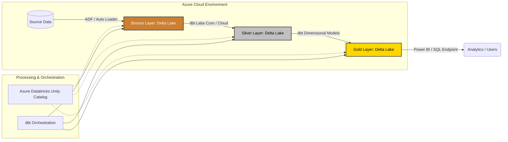

# 🛒 Azure Databricks Medallion Pipeline: Olist E-Commerce Analytics

[](https://getdbt.com)
[](https://microsoft.com)
[](https://delta.io)

## 📝 Project Overview
This project implements an end-to-end, production-grade ELT data lakehouse pipeline using the **Olist Brazilian E-Commerce dataset**. The architecture follows the **Medallion design pattern** to transform raw, highly transactional e-commerce data (orders, customers, payments, reviews, and products) into an optimized, business-ready **Kimball Dimensional Model** for advanced analytical reporting.

The system relies on **Azure Databricks** for highly scalable, on-demand compute and storage optimization, paired with **dbt (Data Build Tool)** to enforce modular transformations, strict data quality testing, and comprehensive data documentation.

---

## 🏗️ Architectural Deep Dive

To minimize infrastructure overhead and keep Azure cloud compute costs low, the pipeline is designed as an **on-demand, manually triggered batch architecture**. This mimics real-world enterprise scenarios where heavy analytical processing is run on specialized schedules rather than continuous, costly idle clusters.



### 🟫 Bronze Layer (Ingestion & Schema Inference)
*   **Mechanism:** PySpark via **Azure Databricks Auto Loader**.
*   **Process:** Raw Olist CSV/JSON landing files are incrementally detected and ingested from Azure Data Lake Storage (ADLS Gen2).
*   **Key Feature:** Implements **Schema Evolution** and inference to handle unexpected changes in e-commerce source data without crashing downstream pipelines.

### ⬜ Silver Layer (Cleansing & Historical Tracking)
*   **Mechanism:** dbt Core / Databricks Spark SQL.
*   **Process:** Data is deduplicated, primary keys are validated, and complex transactional strings (like Portuguese e-commerce category remapping) are standardized.
*   **Key Feature:** Implements **Slowly Changing Dimensions (SCD Type 2)** to historicalize changes in seller locations and customer profiles over time.

### 🟨 Gold Layer (Dimensional Modeling & Performance)
*   **Mechanism:** dbt Core materialized as **Delta Lake tables**.
*   **Process:** Data is decoupled into a clean Star Schema consisting of high-performance **Fact tables** (e.g., `fct_order_items`, `fct_customer_reviews`) and **Conformed Dimension tables** (e.g., `dim_products`, `dim_sellers`, `dim_geography`).
*   **Key Feature:** Applied Databricks **Liquid Clustering** (or `Z-ORDER BY`) on high-cardinality join keys (`order_id`, `product_id`) to optimize query speeds for BI tools like Power BI.

---

## 🛠️ Tech Stack & Skills Showcased
*   **Cloud Infrastructure:** Azure Data Lake Storage (ADLS Gen2), Azure Databricks.
*   **Data Governance:** **Unity Catalog** for structural separation of schemas, row/column-level security, and data lineage mapping.
*   **Data Transformation:** **dbt Core** (leveraging incremental materialization models to save compute costs during manual runs).
*   **Storage Engine:** **Delta Lake** (ACID transactions, time travel, and performance optimization).
*   **Data Modeling:** Kimball Dimensional Modeling (Star Schema design).

---

## 📂 Repository Structure

```text
azure-databricks-medallion-dbt-pipeline/
│
├── azure-infra/                  # Azure infrastructure definitions
│   ├── setup_environment        # Scripts for landing/raw storage containers
│   └── unity_catalog_setup.sql   # SQL for Catalogs, Schemas, and Grants
│
├── databricks-notebooks/         # Ingestion layer code
│   └── Raw Ingestion from ADLS2 #  Auto Loader stream definition
│
├── dbt_lakehouse/                # Main dbt project folder
│   ├── macros/                   # Custom dbt macros (for schema )
│   ├── models/
│   │   ├── gold                  # GOLD LAYER (Dimensional Modeling / Kimball)
│   │   ├── silver                # SILVER LAYER (Cleansing, deduplication, SCD2)
│   │                  
│   ├── seeds/                    # unused
│   ├── tests/                    # Custom data validation tests
│   ├── dbt_project.yml           # Core dbt configuration
│   └── packages.yml              # Managed dbt packages
│
└── README.md                     # Main documentation hub
```

---

## 🚀 Deployment & Execution Runbook

This pipeline is designed for on-demand batch processing to optimize Azure compute costs. To run the end-to-end pipeline manually, execute the following commands:

1. **Ingest Raw Data:** Execute the Databricks Auto Loader notebook to pull the latest source files into the Bronze layer.
2. **Authenticate dbt to Databricks:** Ensure your environment variables or Databricks PAT (Personal Access Token) are set.
3. **Execute dbt Pipeline:**
   ```bash
   # Navigate to dbt directory
   cd dbt_lakehouse

   # Install dependencies
   dbt deps
   
   # Run data quality tests on raw incoming sources
   dbt test --select source:*
   
   # Run and materialize Bronze-to-Silver-to-Gold models
   dbt run
   
   # Verify referential integrity across Fact and Dimension tables
   dbt test
   ```

---

## 📈 Engineering Highlights & Business Value
*   **Cost Efficiency:** Built entirely using `incremental` dbt logic. Even when executed manually, the pipeline only scans and updates modified records instead of scanning the full dataset, reducing Databricks DBU consumption.
*   **Data Integrity:** Implements rigorous data quality constraints via dbt tests, catching broken referential integrity (e.g., an order item referencing a non-existent product ID) before data reaches production analytics.

---

## 📈 Future Roadmap: Automation & Scale
To transition this from a manual on-demand batch system to an automated enterprise platform, the next structural iterations would include:
*   **Orchestration:** Wrapping the dbt CLI run commands inside an Azure Data Factory (ADF) pipeline or Databricks Workflow.
*   **Triggering:** Setting up an ADF Storage Event Trigger to automatically spin up the Databricks cluster only when a new source file lands in Azure Blob Storage / ADLS Gen2.
